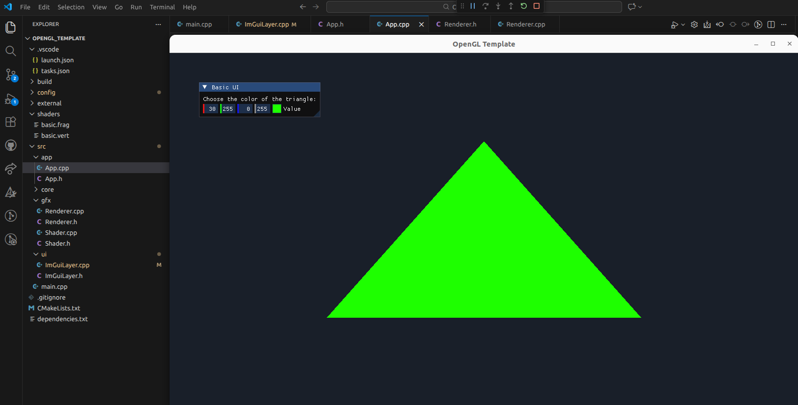

# OpenGL + ImGui Template

This repository provides a minimal **OpenGL template** designed for learning, experimentation, and rapid prototyping. It sets up a working rendering environment with **ImGui integration**, a simple input system, and a basic example that you can easily expand.

The goal is to give you a starting point where you can focus on learning graphics programming concepts without worrying about boilerplate setup. Don't panic if you don't understand some of the code. I'm no expert, I've tried to make it as simple as possible, while giving option to expand without it being too difficult.

---

## Preview





---

## Features

- OpenGL window creation
- ImGui integration for real-time UI controls
- Basic input system for keyboard and mouse
- Example triangle rendering
- Clean structure for easy extension
- Easy debug system using VSCode (F5)

---

## Requirements

Before running the project, install the necessary dependencies:

```bash
sudo apt install -y build-essential cmake gdb pkg-config \
  libglfw3-dev libx11-dev libxrandr-dev libxinerama-dev libxcursor-dev libxi-dev \
  mesa-common-dev libgl1-mesa-dev
```

--- 

This project expects ImGui to be located inside the external/ folder. To install:

```bash
    cd external
    git clone https://github.com/ocornut/imgui.git
```
## Build Instructions

To compile and run the project:

1. Make sure the build folder is empty or create one if it does not exist:


```bash
    rm -rf build
    mkdir build
```

2. Run the CMake configuration + compile
```bash
    cmake -S . -B build -DCMAKE_BUILD_TYPE=Debug
    cmake --build build -j
```
3. Run the executable:
```bash
    ./build/app
```


## How to Use This Template

You can modify this project to learn or experiment with:

- Shaders
- Camera systems
- Lighting models
- Textures
- 3D meshes
- Post-processing
- UI tools

The idea is simple:

> Start from the working base and expand it step by step.

---

Feel free to modify and expand this template to suit your learning goals.